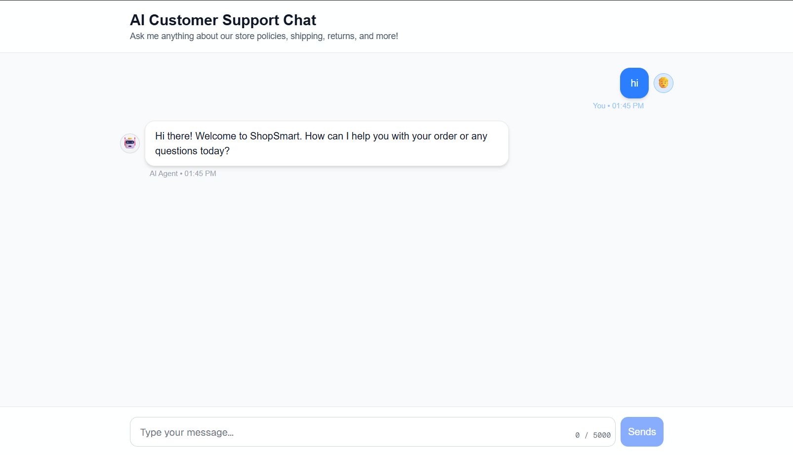

# AI Live Chat Agent
Customer support chat with TypeScript/Express backend and Next.js frontend. Persists conversations to Postgres (Neon), uses OpenAI primarily with Gemini fallback, and embeds store FAQ knowledge in the prompt.

## How to Run Locally (step by step)
1) Prereqs: Node 18+, npm.  
2) Backend:
   - `cd backend`
   - `npm install`
   - Create `.env` (see Env Vars)
   - `npm run dev`
3) Frontend:
   - `cd frontend`
   - `npm install`
   - Optional: create `.env.local` (see Env Vars)
   - `npm run dev`
4) Open http://localhost:3000 and chat.

## DB Setup (migrations/seed)
- Uses Neon Postgres. Create a project and copy the connection string (include `sslmode=require`).
- On backend start, tables are auto-created (no manual migrations needed):
  - `conversations (id, session_id, created_at, updated_at)`
  - `messages (id, conversation_id, role, content, created_at)`
- No seed data required; messages are persisted as you chat.

## Environment Variables
### Backend (`backend/.env`)
```
PORT=3001
DATABASE_URL=your_neon_connection_string      # required
OPENAI_API_KEY=your_openai_key               # required (primary LLM)
OPENAI_MODEL=gpt-3.5-turbo                   # optional
GEMINI_API_KEY=your_gemini_key               # optional (fallback)
GEMINI_MODEL=gemini-1.5-flash-8b             # optional
REDIS_URL=redis://localhost:6379             # optional caching
FORCE_GEMINI_FALLBACK=true                   # optional: force Gemini use
```
### Frontend (`ai-chat/.env.local`)
```
NEXT_PUBLIC_API_URL=http://localhost:3001    # optional; defaults to this
```

## Architecture Overview
- **Backend (Express, TS)**
  - `src/index.ts` – app bootstrap, middleware, DB init.
  - `src/routes/chat.ts` – `POST /api/chat`, `GET /api/chat/history/:sessionId`; validation, caching, persistence, LLM orchestration.
  - `src/services/llm.ts` – LLM wrapper (OpenAI primary, Gemini fallback), prompt/history handling.
  - `src/services/cache.ts` – optional Redis response cache.
  - `src/db/init.ts` – table creation.
  - `src/db/queries.ts` – conversation/message CRUD.
- **Frontend (Next.js / React)**
  - `app/page.tsx` – chat UI, session handling, history load, API calls.
  - `app/components/ChatInput.tsx` – input with length limits and UX cues.
  - `app/components/ChatMessage.tsx` – message bubbles.

## Interesting Design Decisions
- **LLM fallback**: OpenAI first; if it fails for any reason, Gemini is attempted (or forced via env).
- **Prompt grounding**: Single system prompt embeds store FAQ (shipping, returns, support hours, policies). History capped to last 20 messages to control tokens.
- **Resilience**: Input validation (empty/type/length), friendly error surfacing, AbortController timeout on OpenAI, status-aware responses.
- **Schema bootstrap**: Auto table creation on startup to simplify local setup (no separate migration runner here).
- **Caching**: Optional Redis cache keyed by session+message to avoid repeated LLM calls.

## LLM Notes
- **Providers**: OpenAI (primary), Gemini (fallback).
- **Prompting**: System prompt = ShopSmart support agent with detailed FAQ; conversation history appended (up to 20 messages).

## Trade-offs & “If I had more time…”
- Would add streaming responses and partial rendering.
- Add tests (unit/integration) and contract tests for the API.
- Add structured logging/metrics (latency, cache hit rate).
- Add auth/rate-limits for abuse protection.
- Add vector grounding over docs, and stricter token budgeting per user.
- Add a migration/versioning tool for schema evolution.

## Preview
